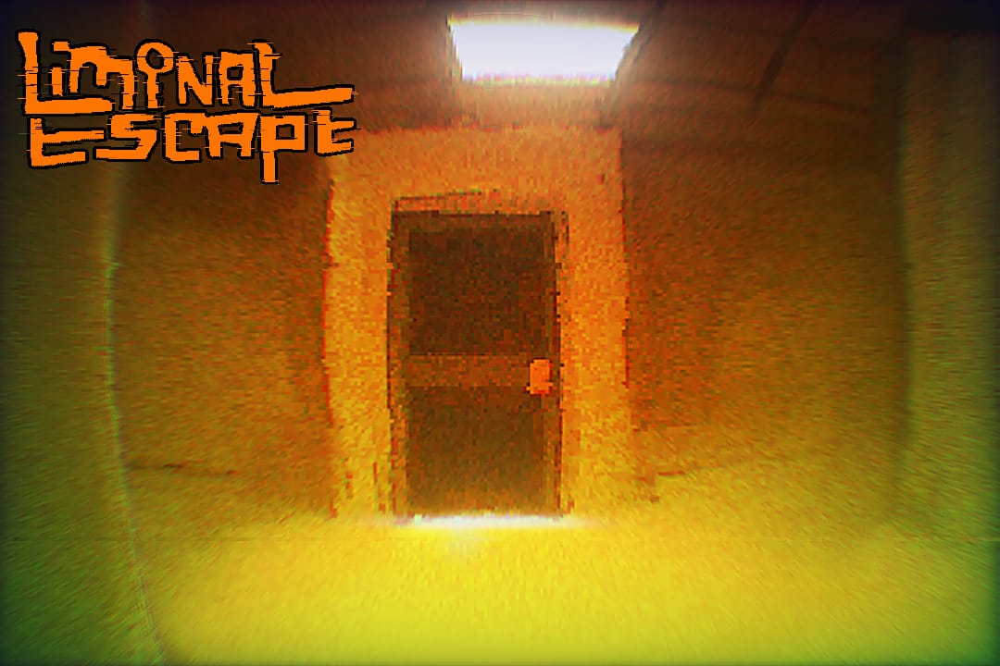

# Liminal Escape



### Description

Liminal Escape es un juego de exploración inspirado en las Backrooms. El 
 jugador debe recorrer un entorno laberíntico, encontrar llaves ocultas y 
 usarlas para abrir puertas y avanzar. La atmósfera está diseñada para 
 generar una sensación de desorientación y tensión.(Traduccion completo 
 al ingles pronto)
### Characteristics

* Exploración en primera persona.
* Niveles generados con OpenGL.
* Mecánica simple: buscar llaves y abrir puertas.
* Ambiente inmersivo y enigmático.
### Technologies

* Lenguaje: C++
* Gráficos: OpenGL

#### Version 0.1

## Installation&amp;execution

#### Requirements

1. ...
#### Installation

```java
String Hello = "Hello world";
```
#### execution

steps for execution

***

1. [Bryan Maradiaga](https://github.com/Bamwilt)

1. [Gerald Rizo](https://github.com/Bamwilt)

1. [Derek Diaz](https://github.com/Bamwilt)

1. [Luis Perez](https://github.com/Bamwilt)

##### License MIT - (created in 2025)
